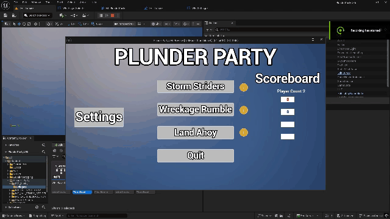

# Plunder Party Unreal 5 Development Commentary by Sasha Ferrand

Video Demonstration:

Itch.io Page:

## Abstract 

***Plunder Party*** is a local-multiplayer mini-game-focused party game developed in Unreal 5.6.1. The requirements were to create at three mini-games. This concept is that the players can play three games which can be selected on the title screen, of which the games all have unique gameplay aspects, and then there is a global tracked score for each player awarded by either completing actions or individual placement in the game. The project was handled with game designers having more input on the concepts of the game in terms of gameplay, while also implementing simple systems, while the programmers took the ideas presented by the designers and implemented the more complex systems in the project, which is the role I took on. 

The three games decided were: 

- ***Storm Strider***, a threat management game with similarities to *Overcooked* in terms of gameplay, and *Five Night's at Freddy's* in terms of implementation of certain game mechanics from a developer point of view. It involves the player working together to keep a ship from being destroyed in a storm by thunder, harsh winds, and squids, while rewarding each player for their individual contribution.

- ***Wreckage Rumble***, a fighting and control-points-esque game based on *Musical Chairs*, where the players compete to get on certain landmarks before a timer runs out and the tide rises, drowning players caught in the tide, and then the timer resets to a shorter time than it originally was, thus leading to only one man standing. The score system is handled by rewarding surviving the longest.

- ***Land Ahoy***, a kart-racer based on *Mario Kart*, where the players play on a procedurally generated course with obstacles and power-up, and compete to get to the finishing line first, where each of the players are scored based on their placement in the race.

## Research

The research of this project mainly served as finding methods to achieve technical goals in the project. Due to prior experience with the engine, and due to the fact that the game designers are responsible for concepting, artistic direction, and base gameplay mechanics, the need for researching outside of queries and tutorials on how to achieve certain outcomes in Unreal were not necessary.

### Interact System

- ***Hold Button - Unreal Engine 5.2 Tutorial by Lisowi*** is a Youtube video about making an interact system that has a visual widget that is displayed on the screen when you approach an interactable actor, that updates when you are currently interacting with an actor via a progress bar. On the surface, this seemed like a perfect tutorial, but it has now become apparent that it was not the best one to use in hindsight. (Hold Button - Unreal Engine 5.2 Tutorial, 2023) 

    The tutorial has 2 main caveats  

    - No distinction between possible interactors

    - No use of an interface, thus making it tedious to expand.

    However, the logic used for the widget that pops up on the screen was useful, as when the game shifted to using an interface-based interaction system, the UI was synced up to the current system rather than being discarded.
    
    Key Take aways:
    
    - Carefully consider if tutorials would be useful for multiplayer projects before committing to actually using it
    

- ***Creating an Interaction System in Unreal Engine 5 | UE5 Tutorial*** and ***Interaction System Tutorial | (Part 2: Laying the foundation) | Unreal Engine 5 (UE5) by Ali Elzoheiry*** are videos apart a multi-part tutorial series about creating an expandable interact system for a variety of different types of games. However, due to the previous tutorial leaving the project with a functional visual element of an interaction system, simply the tutorial on how to get an interaction interface set-up was necessary. A key benefit to this tutorial is that is has a system that gets all actors near the interactor (instances of players), and then only executes code in the closest actor that has the interact interface event. This means the interactor may not interact with multiple actors if they are in range of two or more. Creating an Interaction System in Unreal Engine 5 | UE5 Tutorial - YouTube, 2025)(Interaction System Tutorial | (Part 2: Laying the foundation) | Unreal Engine 5 (UE5), 2025)

    Key Take aways:
    
    - Interaction systems require careful designing, and should always be prepared with the idea in mind that they will be expanded upon
    - Interfaces are useful for creating repeating code without actually recreating the code in each instance it is needed
    

### Quality of Life 

A lot of the work done was also for the multiplayer system and the main menu, so early on some options were added for the game on the main menu, which include a fullscreen mode toggle and a volume slider. It is not a requirement for the project, but it adds a layer of polish to the project. 

- ***How To Change Windowed Mode in Unreal Engine 5 | UE5 Concept Overview by Keltick's Game Dev*** is a Youtube video about adding fullscreen functionality to an unreal game, and it was used for the fullscreen mode toggle, by checking the game user settings, and setting fullscreen mode or windowed mode depending on the check box's state, and then sends that top the game settings. (How To Change Windowed Mode in Unreal Engine 5 | UE5 Concept Overview, 2025)

    Key Take aways:
    
    - Fullscreen is done by altering 'Game User Settings' and applying it to 'Resolution Settings'

- ***How to Make a Simple Volume Slider in Unreal Engine 5 by Gorka Games*** is a Youtube video about adding a volume slider with a master volume sound class mix to alter the game's volume globally, which is done by altering a sound class mix that is connected to the slider's variable. (How to Make a Simple Volume Slider in Unreal Engine 5, 2023)

    Key Take aways:
    
    - To efficiently edit volume, you must edit the master sound class of unreal, which automatically applies itself to all sound effects that are applied to the master sound class

## Implementation

Overall, contribution to the project covered alot of areas, but the areas I contributed most to were syncing up the games with the score system and game instances, adding timers and the logic surrounding them, implementing systems that can be expanded upon by game designers, and UI. The largest contribution done was in ***Storm Strider***, as ***Land Ahoy*** was handled mostly by a game designer, and ***Wreckage Rumble*** was somewhat mismanaged by the designer working on it, making is tough to even know where to begin.

### Lobby

#### Creating players

The creation of players was a massive hurdle in the development of the project. For most of the project, it involved automatically creating characters based on the number of input devices connected at start up, and if any devices were connected during run time in the Lobby. However, this lead to a mysterious ghost player appearing inconsistently. 

So, the system was redesigned to reflect how multiplayer games like *Mario Kart* handle it. This is done with a selection menu where you choose how many players you want to play with at start up.

  
[ Figure 1. WB_PlayerSelect's Event Graph.] 

How this is handled is mostly within `WB_PlayerSelect`, with some relevant variables being in `GI_PlunderParty` due to their use outside of the lobby level, and logic in the level blueprint for loading the menus. How it works is that in the level blueprint, it checks a boolean; `hasGameBegun`, and if it is true, it loads the title screen, but by default, it is false, so it opens up the player select widget. This is to ensure that when the minigames end, you are not taken back to the player select menu but instead are taken straight to the main menu.

  
[ Figure 2. LVL_Lobby Blueprint.] 

In the player select widget, there are buttons for the amount of players wanted, including single-player, but that is simply because one of the games *can* be played single-player. Each buttons creates the necessary players and controllers, sets `Number of Players` in the game instance to the amount selected, sets `hasGameBegun` to true, disabled splitscreen and then opens up the main menu.

  
[ Figure 3. Player Select Menu.] 

#### Settings

The settings menu is a drop down menu that has options for fullscreen support, and a volume slider

The logic begins in `MENU_Main`, where a button starts up a check on a boolean variable, `settingsOpen`, which then either executes code for adding `WB_Settings` to the viewport, or removing it from such depending on if its true or false

  
[ Figure 4. The options menu on the titlescreen.] 
 

In `WB_Settings`, theres a checkbox for fullscreen, and a slider for volume. 

The Fullscreen functionality is handled checkiong if the checkbox is ticked or not, and depending on its state, either sets the fullscreen mode to `Windowed Fullscreen` or `Windowed`, and applies it to the resolution settings of the game.

  
[ Figure 5.WB_Settings Fullscreen Logic.]

For the volume slider, it changes the volume of the sound mix class, `Master`, which is then pushed to the modifier
`SM_MasterVolume`

  
[ Figure 6.WB_Settings Volume Logic.]

  
[ Figure 7.WB_Settings Opening on the titlescreen.]

#### Scoreboard

The scoreboard is the backbone of the score system. This is apart of `MENU_main`, and it displays the variables set in the `GI_PlunderParty` that keep track of each player's score. On construction of the the widget, it checks the number of players in `GI_PlunderParty`, and sets the visibility of the scoreboard to be consistent with the amount of players.

  
[ Figure 8. MENU_Main GetText function for Player 1 score. Logic is identical for other players]

  
[ Figure 9. MENU_Main visibility for the scoreboard to correspond to number of players ]

On top of that, there is a function that displays the amount of players currently playing below the scoreboard title. This was originally for testing purposes of another player creation system that was scrapped, but it adds some visual polish so it was kept

  
[ Figure 10. Playercount display code ]

  
[ Figure 11. Scoreboard in MENU_Main ]

This updates after every game, to show the current scores of all the players

#### Main Menu Buttons 

The rest of the lobby related logic is in `MENU_main`, which is simply the rest of the buttons. 

Each minigame has a button as an entry point to the level

  
[ Figure 12. Mini-Game Button Code ]

To go along with the game quality of life features added in the settings menu, a quit button was added to the title screen beneath the minigame buttons

  
[ Figure 13. Quit Button Code ]

Passingly, a game designer mentioned the functionality to add information menus for each of the games, so the following was done

Next to each game button in the menu, a button is added that removes the main menu widget and replaces it with a widget that shows the tutorial for each mini game, which has a quit button to remove the tutorial and brings back the main menu. This would allow the game designers to explain each game's lore, objective and controls. However, despite being asked to make this feature by the game designers for them to use, actually writing out the tutorials was neglected by the designers

  
[ Figure 14. The Main Menu ]

  
[ Figure 15. Tutorial Menu, was not used by game designers ]

  
[ Figure 16. Tutorial Button Code ]

  
[ Figure 17 Tutorial Quit Button Code ]

### Storm Strider

#### Timer

In `GM_STORM_STRIDER`, from `Event tick`, there is a macro called `timer`. The purpose of this macro, as the name suggests, is the timer of the game. 

How it works is that there is a delay, set to 1 second by default, which when complete, subtracts 1 from a variable, `realTime`

The delay can be changed, via the sails on the boat once interacted with, and when doing so, it divides the delay in by another variable; `delayMult`. This is a variable rather than a magic number to allow for game designers to quickly see the variable and have it change. Currently, it is set to 2.

  
[ Figure 18 Timer Function up to the subtraction section ]

After the logic of the timer subtracting, if the timer is not 0, it targets macros for spawning the threats, and then if the timer has hit 0, it calls a macro `sendScoresToGameInstance` and then brings the players back to the lobby.

 
[ Figure 19 Timer Function calling macros ]

Then, in `WB_UI`, it casts to `GM_STORM_STRIDER` to get `realTime` and then displays that to the screen

 
[ Figure 20 Timer Get Text ]

 

[ Figure 21. Timer Ticking Down ]

#### Ship HP

In `GM_STORM_STRIDER`, from `Event tick`, there is a macro called `hpDrain`. The purpose of the such is to calculate the damage done to the ship per how many threats exist on the ship. 

Within `hpDrain`, it checks for how many actors of the classes `bp_Big_tentacle`, `bp_Tentacle` and `bp_Lightning`, top of just checking if any instance of`bp_Ship_Controls` has `sailsBroken` being true. With the actors it is checking for the amounts of, it gets the length of the actors of an array and adds them together to deal the damage necessary to the ship, and is then subtracted from the `shipHP`.

 

[ Figure 22. hpDrain getting number of threats to calculate damage per second ]

Then, the `shipHP` is turned into a percentage for UI purposes, and with that percentage, it is checked if the ship reaches 0% hp, the players instantly lose and are sent to the lobby 

 

[ Figure 23. hpDrain turning the HP into a percentage for the UI ]

Then, in `WB_UI`, it casts to `GM_STORM_STRIDER` to get `shipHPPercent`, formats the variable in text with a percentage and prefix, like such: `Ship HP : {shipHPPercent}%`, and then displays that to the screen

 

[ Figure 24. WB_UI logic for getting the percentage ] 

 

[ Figure 25. HP draining when threats are left unattended ] 

When the HP reaches 0, it exits the level to `LVL_Lobby`

#### Interact Interface

The interact system was originally handled by a game designer, but the method used only targeted the first instance of the player blueprint and was not easily expandable. So the newer system that was implemented was one that utilized an interface to hold events related to interacting, said interface is `BPI_Interactable`, which has a function called `Interact`, with a character reference variable as an input called `Interactor`.

Then, in `BP_Storm_Strider_Character`, there are three relevant events: `On Component Begin Overlap (CapsuleComponent)`,`On Component End Overlap (CapsuleComponent)`, and `EnhancedInputAction_IA_Hold_Interact`.

In begin overlap, it checks if the actor overlapping with the player character implements the interface, and if it does, it calls the trigger for the Interact UI, and adds said actor to a table of all interactable Actors in range in the variable: `InteractablesInRange` 

 

[ Figure 26. Begin Overlap in the Player character that add interactable to an array ]

Then a function called `getActiveInteractable` gets `InteractablesInRange` and gets the most recent index in the table, and sets that to be the current interactable that the player is interacting with. This means the if there is 2 interactables in range, only the one that overlapped last will count as active.

 

[ Figure 27. getActiveInteractable function ]

End Overlap does the opposite of begin overlap. It removes the index of the interactable actor that stopped colliding with the player

 

[ Figure 28. End Overlap in the Player character that removes interactables from  an array ]

The last relevant event, the input action `IA_Hold_Interact`, simply runs the necessary code. As the button is held, `HoldNumber` increases incrementally by 10, and when it reaches 100, when the action is complete, or when the action is cancelled, it is set 0 multiple times. This was to bypass an issue where the number would keep resetting back to 10 as opposed to 0, so the code forces it at multiple times to be 0 as a band-aid fix

 

[ Figure 29. IA_Hold_Interact related code for the number on the Interact UI ]

When the input action is triggered, it gets the active interactable and passes that through the interface to the targeted actor. For the sake of explanation, since the code that comes after the interact interface was done by designers, `wb_woodpile` will be the example of how the interact works, but frankly, the interact interface works identically for all the other actors, it just simply triggering different logic. In the case of `wb_woodpile`, it gets the instance of the player via the `interactor` variable and casting to the player class, and makes the variable `Can repair` true.

 

[ Figure 30. Woodpile Interact Event ]

 

[ Figure 31. Woodpile Interact In-Game ]

#### Interact UI

Much like player creation, this was a great hurdle in the development of the game. It was implemented very early on into development by the game designer of ***Storm Strider***, as I was busy on something else. Unfortunately, the UI simply appeared at the middle of the screen, the interact system did not use interfaces, and all players shared the same interact UI.

So, using the new and improved interact interface, the system was redesigned to render the interact UI on each interactable actor as opposed to the player. Unfortunately, this causes the issue of multiple players interacting with the same object only being able to see the interact of the player who last entered range with the interactable, but that was a sacrifice that had to be made, due to the game designer really wanting an interact UI

In `BPI_Interactable`, there are two more functions, `EndOverlap` and `BeginOverlap`, which are called in `BP_Storm_Strider_Character`. Then, in any blueprint that is meant to be an interactable (as the code is all the same), they are given a component called `AC_InteractWidget`

 

[ Figure 32. Begin Overlap in the Player character that calls `BeginOverlap` ]

 

[ Figure 33. End Overlap in the Player character that calls `EndOverlap` ]

`AC_InteractWidget` sets up the logic required to draw the widget itself, it adds a widget component, it sets the widget space, it sets the draw size, it calls `WB_Interact` as the class used, makes it invisible by default and then sets its location to the actor with the component. It has two custom events in it aswell: `Enable Widget` and `Disable Widget` which when called sets the visibility of the widget to be true or false, but also sets the index of the player making the widget visible.

 

[ Figure 34. AC_InteractWidget Events]

Then, in any blueprint that is meant to be interactable, for example `bp_woodpile` or `bp_lightning`, have the outputs of the events: `EndOverlap` and `BeginOverlap`. `EndOverlap` simply disables the widget via `Disable Widget`, while `BeginOverlap`, gets the controller of the interactor, which is a player, and then gets the ID of the interactor and enables the `WB_Interact` to spawn via `Enable Widget`

 

[ Figure 35. Woodpile Interact UI events]

`WB_Interact` then gets the player index set in `Enable Widget` to get the `HoldNumber` variable from the instance of `BP_Storm_Strider_Character` with the specified ID, and displays `HoldNumber`, and makes a progress bar with said number.

 

[ Figure 36. Interact UI get percent]

 

[ Figure 37. Interact UI get text]

[ Figure 38. Woodpile showing Interact UI ]

#### The Cannons

The logic behind `BP_Cannon` was the only logic after the initial interact not designed by the designer. There is logic for animation but that was handled by the designer. 

The interactor's score variable is accessed via the `interactor` variable and casting to the player class, and then it checks how many big tentacles are on the field, and then applying 2 score per each big tentacle. It then does the same the regular tentacles, but only gives 1 score per regular tentacle. It then destroys all of the tentacles on the field and calls `Disabled Widget` for the interact UI.

[ Figure 39. Cannon code related to the killing of tentacles ]

[ Figure 40. Cannon killing tentacles in action ]

#### In-Game Score and Can Repair UI

Near the end of development, the game designer wanted the score to be visual, along with the variable that displays if each player is able to interact with broken sails and lightning fires. So it was decided to add that to `WB_UI`

In the widget blueprint, there are 8 functions pertaining to displaying the score of each player and the can repair variable. They are all identical aside from targetting players of different player indexes.

`GetPXCanRepair`, (with `x` standing for 1-4), it gets the `Can repair` variable by casing to `BP_Storm_Strider_Character`, and if true, it sets the text of the text box to be 'Can Repair', if not, it is set to empty.

[ Figure 41. Getting the variable of can repair from the Player and formats it accordingly ]

Similarly, `GetPXScore`, (with `x` standing for 1-4), it gets the `score` variable by casing to `BP_Storm_Strider_Character` and sets the integer value as the text

[ Figure 42. Getting the variable of score from the Player ]

When the widget is constructed, much like the scoreboard, it gets the number of players by casting to `GI_PlunderParty` and sets visibility of the UI in accordance to how many players have been selected.

[ Figure 43. Setting visibility of UI elements depending how many players are active ]

#### Passing Scores

In `GM_STORM_STRIDER`, once `realTime` reaches 0 in the `timer` macro, another macro is called, named `sendScoresToGameInstance`.

In `sendScoresToGameInstance`, it casts to `GI_PlunderParty` to get the total score variables, and then it casts to each instance of `BP_Storm_Strider_Character`, and then gets the score of each character, and adds that to the total score in the game instance

[ Figure 44. sendScoresToGameInstance in Storm Strider ]

### Land Ahoy

#### Passing Scores

How scores are passed in the game begin in the actor `Course_Finish`. It gets the player that overlaps with it, and casts to `Land_Ahoy_Player_Character ` and `Land_Ahoy_Player_Controller`, and then sends over a reference to the player, and its index to an event; `Finished`

[ Figure 45. Course_Finish Overlap getting variables and passing it to the player blueprint]

In `Land_Ahoy_Player_Character`, `Finished` triggers code that checks if the player instance has finished the race, and if so, the reference and index are then passed to another event, `Finish`

[ Figure 46. Land_Ahoy_Player_Character Finished event sending variables to GM_LandAhoy ]

In `GM_LandAhoy`, `Finish` triggers code that deals with ending the game, but what is relevant to passing scores is the function `sendScoreToGameInstance`.

[ Figure 47. GM_LandAhoy finishing the race and calling the function sendScoreToGameInstance ]

The function casts to `GI_PlunderParty` to get the score variables of each player, and then there are 4 macros after that, which are all identical aside from the amount of score given. Each macro checks the place of player, and if its not the corresponding placement in the race, it moves on to the next macro

[ Figure 48. sendScoreToGameInstance calling 4 macros to check what place the player is in ]

If the corresponding placement is equal to what the macro is checking, it then checks the corresponding index of the player. Said index then determines which player score in the game instance it should target, then adds the score won by the players placement. 1st to 4th gets 4-1 score, and their values are stored in `1st-4thPlaceScores`, which are all integers

[ Figure 49. ifFirstPlace checking which player is in first place ]

#### Disable Splitscreen

Due to ***Land Ahoy*** having splitscreen, a issue occurred where after Land Ahoy ends and brings you back to the titlescreen, the split screen would stay. So in `LobbyGameMode`, in begin play, it simply sets fullscreen to be off

[ Figure 50. LobbyGameMode disabling splitscreen ]

### Wreckage Rumble

#### Timer 

In `GM_WRECKAGE_RUMBL`, from `Event tick`, if the `deathToll` variable is not equal to the amount of players in the game, ergo, there are still player's left in the game, it calls the `timer` macro.

[ Figure 51. GM_WRECKAGE_RUMBL setting max time and calling timer macro every tick if the game has not ended ]

Within the `timer` macro, there is a delay that is set to 1 second, which when complete, subtracts 1 from a variable, `realTime` if it is larger than 0. If not, it checks if it is less than 0, and if so, it opens the lobby level. Otherwise, it checks for all players on the map if `isOnRubble` is true and if `isNearOtherPlayer` is true. If either are true, the player is killed and then executes the code to send the scores to the game instance, spawn power ups, and relevant to the timer itself, reset it. 
 

[ Figure 52. Timer macro logic for making the timer tick down]

The timer resets by setting it to the `maxTime`, a variable equal to the default value of `realTime`, subtracted by a `subtractor` integer, which is currently set to 2 but can be changed for balancing reasons. In practice, this allows for the timer to become smaller and smaller upon resetting, quickening the pace of each round of the game. 

 

[ Figure 53. Timer resetting with 2 subtracted every round]

#### Passing Scores

In `GM_WRECKAGE_RUMBL`, there is a function called `sendScoresToGameInstance`. It gets the player controller of a player killed in the game, whether it is by the cannon, by drowning when the timer is up, or by being too close to a player when the timer ends. A variable, `deathToll` is incremented by 1 every time a player dies. `deathToll` is the multiplied by a variable `scoremult`, incase the game designers want to scale the scores to a different magnitude than increments of 1. Then, `GI_PlunderParty` is casted and it is then checked what the player ID is. The game then passes the score to the corresponding player score in the game instance depending on the ID

 

[ Figure 54. sendScoresToGameInstance macro in Wreckage Rumble]

#### Spawning Power Ups

Within the `timer` macro of `GM_WRECKAGE_RUMBL` , once the timer resets, it spawns the cannon and tile destroying power ups `BP_Boat_Powerup` and `BP_Shark_Powerup` within the plane the game takes place in, its location determined is randomly via two `Random Float in Range` nodes for the X and Y component, while Z stays constant

[ Figure 55. Spawning power up logic in timer macro that is triggered after every round ends]

[ Figure 56. Timer resetting and spawning the power ups]

#### Fixing Cannons for Score

Once the game was connected to the lobby score system, it was known that the powerups were completed by others on the team, but due to the fact that one of them involved killing players, it became apparent that attaching the score system to the cannon powerup was necessary

The cannons function by killing the player on rubble, the green tiles, if the player collides with `BP_Cannonball`. If this occurs, it calls an event in `BP_WREACKAGE_RUMBLE_Character`, called `Death`, and passes through the ID of the player being killed. 

[ Figure 57. BP_Cannonball calling `death`]

In `BP_WREACKAGE_RUMBLE_Character`, `Death` activates the player's mesh to simulate physics, allows collision, disabled input in the player, and then calls an event in `GM_WRECKAGE_RUMBL`, called `cannonBallDeath`

[ Figure 58. BP_WREACKAGE_RUMBLE_Character calling cannonBallDeath]

In `GM_WRECKAGE_RUMBL`, `cannonBallDeath` then passes the player index to `sendScoresToGameInstance`

[ Figure 59. cannonBallDeath calling sendScoresToGameInstance in GM_WRECKAGE_RUMBL ]

[ Figure 60. BP_Cannonball killing a player on a green tile]

## Play Testing

### Methodology

All playtests were guided, simply because of the fact that the tutorial button was never utilized by the designers to explain the controls and objective.

The playtesters were made to play at least one round of each game. Any comments made while playing, or personal observations made, were written down after the playtest ended

A feedback form was made to gather ratings and comments on gameplay mechanics and bugs, to both aid programmers and designers in tweaking and improving the game

The feedback form has ratings for each game mechanically, and then a long answer text to explain their reasoning, and a final question asking if they encountered any bugs during playtesting. The long answer responses, except the one regarding bugs, were made optional, to not make play testers feel forced to write out anything and thus give up on submitting their results. The bugs one was mandatory but was explicitly written that the playtesters can write 'no'. This is fine even if a respondent does not answer, as a programmer was always watching the playtest, and thus, can see if any bugs happened to begin with

### Statistics Observations and Conclusions

In total, the game amassed 9 playtesters, 8 of which being unique, as a repeat playtest would show improvement.

#### Storm Strider

**From Playtesters**

The interact UI was quite a bother to a lot of play testers, which is quite understandable. However, with it being such an issue to implement, trying to make each actor spawn an additional one on top is a task too daunting, especially for how late playtesting was and there were more pressing bugs.

[ Figure 61. Ratings of Storm Strider]

[ Figure 62. Feedback of Storm Strider]

**Personal Observations**

- Players struggle to understand the interact HUD due to it only showing once per interactable

- Players often seemed to struggle to understand the game even when explained in depth prior to playing.

- With how the cannons were modelled by the designers, the interact UI always shows up near the top cannons only, even if the player is in range of the bottom cannons

- The difficulty is quite unfair

**Addressing Feedback**

As aforementioned, I could not do much regarding the Interact UI specific issues, due to the fact that it was already incredibly time consuming to implement and will simply be a flaw of the game. Ideally, multiple widgets would spawn, ideally on the player, but that seemed impossible with our skill set.

I did pass to the game designers that they should tweak the difficulty to be made much lower,  especially with a dynamic difficulty system implemented by the game designers, which was somewhat done.

#### Wreckage Rumble

Overall negative reviews, which makes sense. It has the least work put into it and the direction of the game was pretty much aimless during development due to poor communication with the game designer handling that game, and was only mechanically complete near the end of the development cycle, and has received zero visual polish. However, the one saving grace is that clearly players see its potential, or even saw its enjoyment as most written responses indicate it having potential. Perhaps if communication was improved and more time was spent on it by the entire team, it could have been a great game.

The final playtests did indicate that the game is quite fun as is, which is great from a programming side of things as it is functionally complete and is fun despite no art direction.

[ Figure 63. Ratings of Wreckage Rumble]

[ Figure 64. Feedback of Wreckage Rumble]

**Personal Observations**

- Players were the least enthuastic about playing, and were often bored

- Players who were enthuastic about the game, however, saw a lot of potential in it

- In the final playtest, a bug suddenly appeared where players couldn't die from drowning if player0 has died

**Addressing Feedback**

The game being unfun, unbalanced and unpolished is simply something handled by the game designer, who didn't bother to address it as at this point, the game designer responsible for the game had essentially abandoned work on the project.

The bug relating to players not dying, was unable to be fixed. So instead of a system that involved destroying the actors, disabling input and making the character ragdoll was put in place, and it worked

#### Land Ahoy

The most positively received of the games, which makes sense. It has the most visual polish and it has been mechanically functional for the longest of the three games. The most negative feedback was simply suggestions regarding even more visual polish for clarity, and collision not matching with the visuals. Some did not understand the shield protecting the player from attacks, some wanted a visual for the reload of the cannons. 

[ Figure 65. Ratings of Land Ahoy]

[ Figure 66. Feedback of Land Ahoy]

**Personal Observations**

- Most fun

- Collision of ships were strange

- Collision of obstacles were also strange

- Players were often confused on which power up they had.

**Addressing Feedback**

The game designer responsible for handling ***Land Ahoy*** addressed the criticism regarding collision. A cooldown for the cannons was considered but had to scrapped due to time constraints, but ideally, it would be a great feature to add

## Critical Reflection

### Positive Reflection

#### Taking Initiative

Throughout the project, I took quite a lot of initiative. When designers needed help, I aided them by making code templates they can easily reuse, as what was done with the ship HP system and player specific UI in ***Storm Strider***. On top of that, I frequently worked spontaneously to add features such as the settings menu and player creation systems on to the project, even though the game designers did not even ask for said features that early on. The designers weren't keen on the score system either, but I enthusiastically added it to each game.

 Even with the issues with ***Wreckage Rumble***'s development, I tried to at least add finishing touches to make the game fully functional, despite it having zero visual polish from the game designer working on it. Instead of stubbornly working with the broken player system, I took the initiative to redesign the entire system to make the project at least polished and functional, even if the system is not ideal.

I was keen on trying to bring the project up to standard as much as I can, despite showing up to the team 3 weeks late.

#### Communication in General

Largely, communication within most of the team was acceptable at worst, or great at best. Sending messages to and responding to most team was done in a timely manner with no heated arguing, only positive to neutral discussion with very little clashing in terms of vision or implementation.

#### Decent functionality

Despite the functional flaws of a lot of parts of the game, this game is a massive improvement compared to the logic I made last semester, even if the game I made last semester has fewer bugs. I utilized systems like gamemodes, game instances, and interfaces more effectively than the last game I made, which primarily had all code in the player blueprint.

The games made were far more technically advanced than the game from last semester due to the fact that it involve multiplayer, the games are not simply point and click, and due to experience from the last project helping a lot, thus skipping the need to research very basic functions of Unreal, and instead research more complex systems.

### Negative Reflection

#### Indecisiveness 

When I joined the team, three weeks had already gone by without much from myself, as I was in an other team with  incredibly poor communication , and instead of abandoning ship earlier, I decided to wait it out until it became too apparent that my older team was not the right fit. Perhaps if I put my foot down sooner, some issues with this current project may not even be present as I would've had more time to address them. But overall, that isn't my fault due to my already significant contribution to the project, and being patient with less than desirable team members is a skill, not a weakness

#### Playtesting

As previously mentioned, playtesting was left till the end mostly, due to internal playtests being sufficient enough during development to find game design issues and bugs. This is also because of challenges arising to make the game playable enough for testing. A lot of setbacks happened during development. Perhaps if prioritizing certain features first over others would have made it easier to allow for playtesting at an earlier state of development to allow more time to address feedback

#### Better Communication

Communication, as previously mentioned, was overall good. However, due to the different mindset game designers have, the reason why playtesting was also neglected was due to the game designers wanting each game to be feature complete before testing. While this is a reasonable point of view, it does negatively affect my side of the project. Perhaps if I was more adamant on getting testing done instead of just adding features, more playtesting would've been done
There was also a team member who was not picking up much slack and was not willing to take initiative, so perhaps if I pushed, they could have helped much more.

#### Complacency with Issues in code

There are some systems which could be improved, but due to lack of knowledge, and needing to make some sacrifices  to meet the deadline in time, there are areas that are sorely lacking in terms of polish. The interact UI in ***Storm Strider*** is only visible on the last player interacting with the interactable, making it hard to tell who is interacting with what. 

The system to create players is also a band aid solution to a problem that was never addressed. It works perfectly fine, but it is not ideal compared to a system that can allow for players to join on the fly. Although, as previously mentioned, this is also a good thing as at least it is functional as opposed to broken.

A few team members didn't pick up much slack, but I do know I could've carried an even bigger portion of work than I already have to sort out these issues quicker than relying on others.

#### Mismatched Naming Conventions

Due to the collaborative nature of the project, a lot of us have different points of view when it comes to naming conventions. I abbreviate the parent class, such as A for Actor, and then write the name, so `A_Box` for example. For variables, macros and functions, I use `camelCase`. However, throughout the project, there is many mismatched naming conventions. Perhaps early on, the team should have agreed upon naming conventions to distinguish things a lot easier. Although, I did come to team the three weeks late, so it is not really my fault, but more so a pet peeve of mine because I know industry standards call for proper naming conventions, and ideally this project would have them too.

### Next Time 

For foreseeable projects in the future, I should:

- Be more assertive to better mine and other's contribution on the project

- Free more time for playtesting

- Free more time to improve the project functionally

- Set naming conventions with the a team early into development

- Try to better manage the burden left by teammates who do not contribute as much

## Works Cited and Bibliography

### Works Cited

Creating an Interaction System in Unreal Engine 5 | UE5 Tutorial - YouTube (2025) At: https://www.youtube.com/watch?v=nySnPkzpUn0 (Accessed  22/04/2026).

Hold Button - Unreal Engine 5.2 Tutorial (2023) Directed by Lisowi. At: https://www.youtube.com/watch?v=rLB1INqs2ro (Accessed  22/04/2026).

How To Change Windowed Mode in Unreal Engine 5 | UE5 Concept Overview (2025) Directed by Keltick’s Game Dev. At: https://www.youtube.com/watch?v=2tRVwujG9BY (Accessed  22/04/2026).

How to Make a Simple Volume Slider in Unreal Engine 5 (2023) Directed by Gorka Games. At: https://www.youtube.com/watch?v=6No5rKgU4Wo (Accessed  22/04/2026).

Interaction System Tutorial | (Part 2: Laying the foundation) | Unreal Engine 5 (UE5) (2025) Directed by Ali Elzoheiry. At: https://www.youtube.com/watch?v=RiGTU96KiIk (Accessed  22/04/2026).

### Bibliography

Five Nights at Freddy’s on Steam (2014) At: https://store.steampowered.com/app/319510/Five_Nights_at_Freddys/ (Accessed  22/04/2026).

Mario Kart (2026) In: Wikipedia. At: https://en.wikipedia.org/w/index.php?title=Mario_Kart&oldid=1348286737 (Accessed  22/04/2026).

Overcooked on Steam (2016) At: https://store.steampowered.com/app/448510/Overcooked/ (Accessed  22/04/2026).

## Declared Assets and Credits
### Roles

**Developers**
- Sasha Ferrand
- Emily Thomas

**Designers**
- Alex Cook
- Ollie Tye-walker
- Lucas Miller

### Audio Assets and Textures

- All audio was not made by team, but there is ***no source***

- The ship, cannons and 'X' decal were made bt ***Alex Cook***

- All other textures were not made by the team but have ***no source***

- All other models were not made by the team but have ***no source***

My contribution was purely on blueprint code, not visual or audio polish. The visuals and audio are not my responsibility

All assets sourced were ***royalty free***.

### IDE and Engine

- ***[Unreal Engine](https://www.unrealengine.com/en-US)***

### Project Template

- Top Down Game Template from ***[Unreal Engine](https://www.unrealengine.com/en-US)***

### Version Control

- Git, hosted on ***[GitHub](https://github.com/)***

### Video Recording

- ***[OBS](https://obsproject.com/)***

## AI Use Declaration

NO AI was used in the modification of files in this project in my involvement. From my knowledge, no one else used AI in the team

